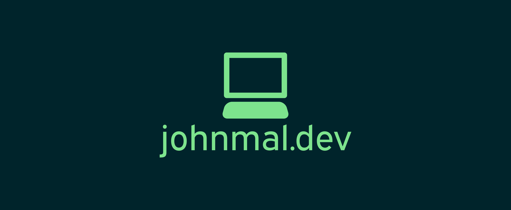

  
    
  

<h1 align="center">👋 Hey, I'm John</h1>
<h3 align="center">A Full-Stack Web Developer from Toronto, Canada 🇨🇦</h3>

Hi, I'm John Malapit. I am a full-stack web developer based out of Toronto, Canada. Ever since I was young, I always had a passion for building things and understanding how things work. Armed with a Mechanical Engineering Degree, I aim to apply my previous experiences as Mechanical Engineer towards my work as a web developer.

## Technologies

### Front-End Development

  
  
  
  
  
  
  
  
  

### Back-End Development

  
  
  
  
  
  
  

### CI/CD, Hosting & Tools

  
  
  
  
  
  
  
  
  
  
  

## My Stats

  

